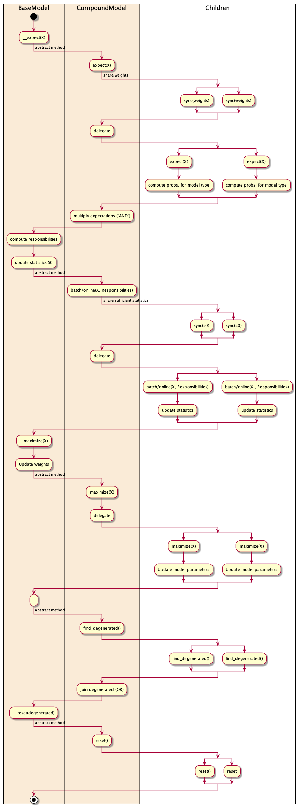

Implementation
==============

.. figure:: _static/classes.png
   :scale: 50 %
   :alt: Missing

   Class diagram of the project and related classes.

.. figure:: _static/OnlineBatch.png
   :scale: 50 %
   :alt: Missing

   Flow chart learning.

   Flow chart of an EM step. Note that the highlighted
   swimlanes represent a single kuberspatiotemporal /compound
   instance. The methods defined in BaseModel are *not* called
   on the children instances (right two lanes). Therefore,
   a synchronization of common variables is required.