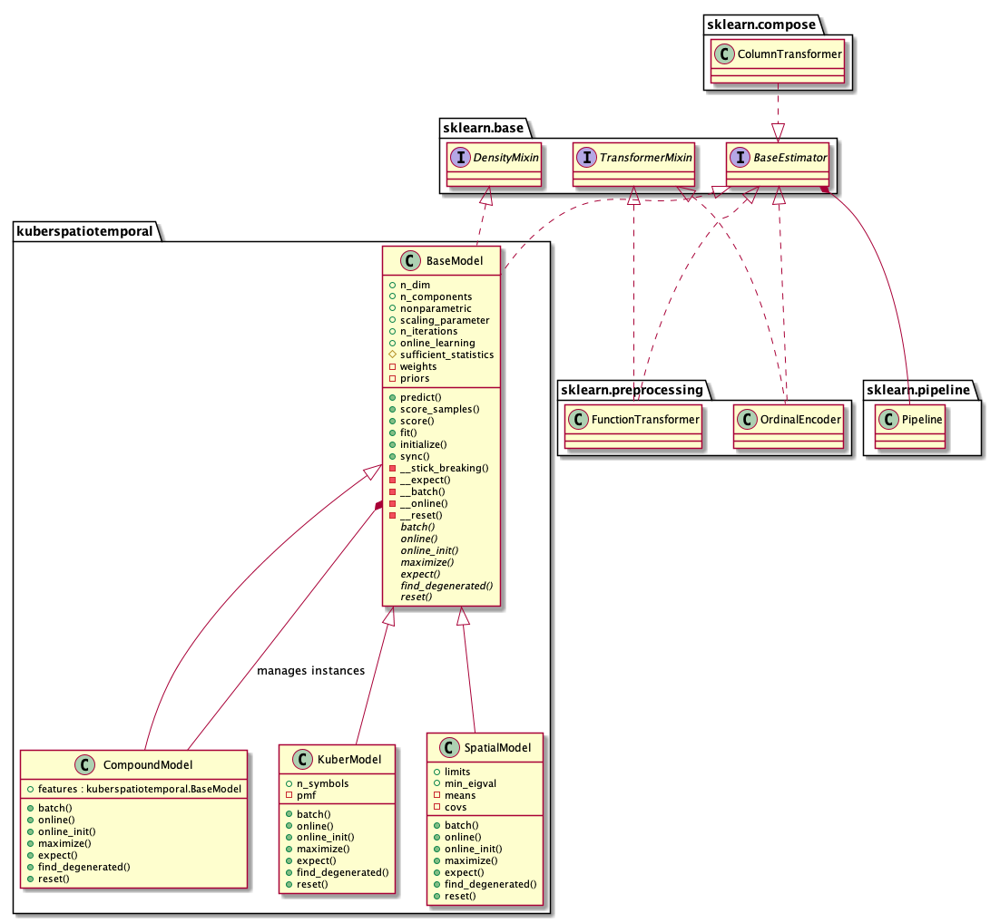
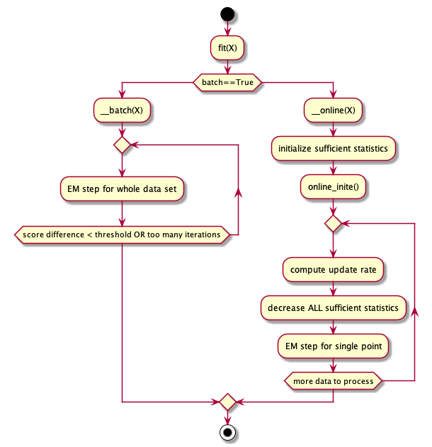

Implementation
==============

Preface
^^^^^^^

Implementation of the package following the steps discussed in the previous chapter, focuses
on an architecture that allows high configurability of the mixture model. In addition,
elevated importance is given to

* Sufficient documented through `sphinx <https://www.sphinx-doc.org/en/master/>`__ (including intersphinx, numpy-style docstrings through napoleon and other measures)
* Avoidance of  boilerplate (e.g., by using the `attrs <https://www.attrs.org/en/stable/>`__ package),
* Simple installation and development (e.g., by using `poetry <https://python-poetry.org/>`_ and supporting `vscode <https://code.visualstudio.com/>`__)

Architecture
^^^^^^^^^^^^

The architecture of this package is kept as simple as possible (it implements a single algorithm after all).
Key concept is the abstract :class:`kuberspatiotemporal.base.BaseModel` class that includes and hides all relevant
details of the algorithm. Therefore most of its crucial members are private (leading underscores)--an advantage, as
private members can be obfuscated. Its children (e.g., :class:`kuberspatiotemporal.SpatialModel` and :class:`kuberspatiotemporal.KuberModel`)
which add details to the specific domain of the feature. Each child of :class:`kuberspatiotemporal.base.BaseModel` represents a *single*
feature! The :class:`kuberspatiotemporal.CompoundModel` however, combines multiple feature instances into
a mixture model and takes care of the shared variables among them. The following class diagram visualizes the relations.

For examples, please look at the documentation of :class:`kuberspatiotemporal.CompoundModel` and the unit tests,
above all, in :code:`tests/test_large.py`. Also of interest is the test :code:`test_batch_unparam_em` in
:code:`tests/test_kuberspatiotemporal.py`. This one is a tests that features a control set.

   Class diagram of the project and related classes.

It is visible that the classes interoperate with :class:`sklearn.base.BaseEstimator` and can be used in pipelines and
with feature extractors (see :class:`kuberspatiotemporal.base.BaseModel` for an example).

The distinction between online and batch learning is given by the following diagram.

   Flow chart learning.

The details of the Expectation Maximization step show the delegation of the
implemented design pattern. Note that the basic algorithm steps of the
features are not called and all children share the same variables with the
:class:`kuberspatiotemporal.CompoundModel`.

.. figure:: _static/EM.png
   :scale: 50 %
   :alt: Missing

   Flow chart of an EM step. Note that the highlighted
   swimlanes represent a single kuberspatiotemporal /compound
   instance. The methods defined in BaseModel are *not* called
   on the children instances (right two lanes). Therefore,
   a synchronization of common variables is required.